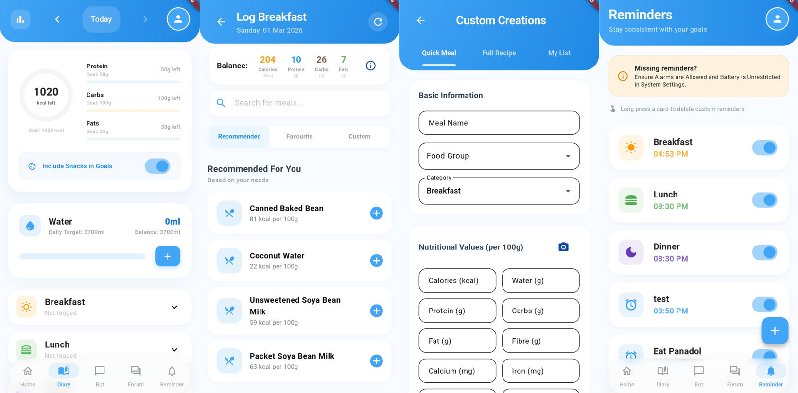

# FoodWise 🥗

FoodWise is a modern, AI-powered meal logging and nutritional tracking application designed to help users achieve their health goals through personalized insights and community support.



## 🚀 Features

### For Users
*   **Personalized Meal Diary**: Track daily intake of Calories, Protein, Carbs, and Fats with a dynamic "Carry-over" system that adjusts your Lunch and Dinner targets based on what you ate for Breakfast.
*   **AI Meal Recommendations**: Integrated with Google Gemini and recommendation model to suggest meals that fit your remaining nutritional budget.
*   **Smart Reminders**: Receive automated alerts for meal times, including a special "1-hour before" notification with personalized nutrient targets and meal suggestions.
*   **Health Progress Analytics**: Interactive 7-day trend charts comparing target vs. actual intake for all major macros and hydration.
*   **Water Tracking**: Gender-based hydration goals (3700ml for men, 2700ml for women) with quick-log functionality.
*   **Community Forum**: Share recipes and tips with nested threaded replies, likes, and a content reporting system.
*   **Secure Authentication**: Support for traditional Email/Password and one-tap Google Sign-In.

### For Admins
*   **System Dashboard**: Real-time overview of active users, meal database, and pending moderation tasks.
*   **User Management**: Monitor member activity and manage account statuses (including banning/unbanning for community safety).
*   **Admin Approval**: Review and approve administrative requests from new staff members.
*   **Food Database**: Create, edit, and search the master list of meals and nutritional data.
*   **Content Moderation**: A dedicated reporting queue to review and remove inappropriate posts or comments.

## 🛠️ Tech Stack
*   **Frontend**: Flutter (Dart)
*   **Backend**: Firebase (Auth, Firestore)
*   **AI/ML**: Google Gemini, Linear Regression
*   **Integrations**: FastAPI, Render
*   **Charts**: fl_chart

## 📦 Getting Started

### Prerequisites
*   Flutter SDK (^3.0.0)
*   Firebase Project with Firestore and Auth enabled
*   Google Cloud Console account (for Gemini API keys)

### Installation
1.  Clone the repository:
    ```bash
    git clone https://github.com/MK-0406/meal_logging.git
    ```
2.  Install dependencies:
    ```bash
    flutter pub get
    ```
3.  Configure Firebase:
    *   Add your `google-services.json` to `android/app/`.
    *   Ensure your **SHA-1 fingerprint** is added to the Firebase Console for Google Sign-In.
4.  Run the app:
    ```bash
    flutter run
    ```

## 📜 License
This project is licensed under the Apache 2.0 License - see the LICENSE file for details.
